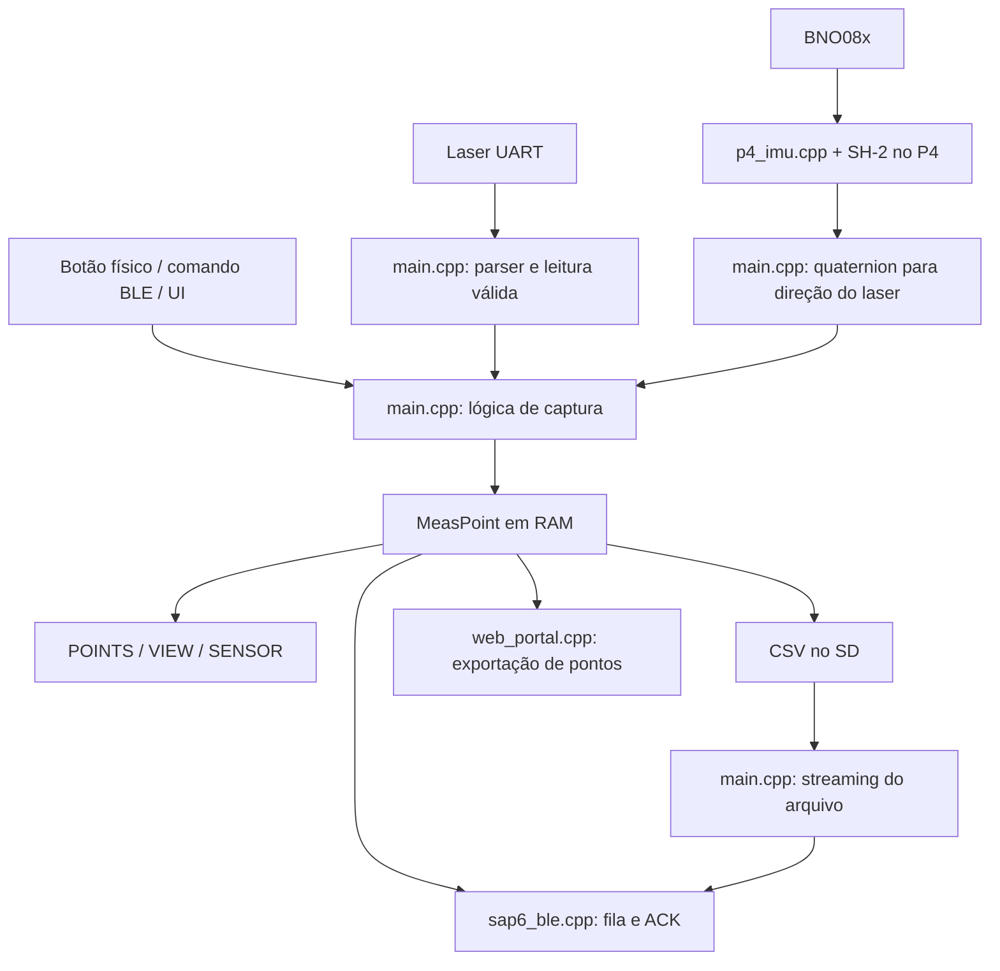

# Guia do repositório MM1-BLACK

Este guia explica onde está cada parte do projeto e como começar a desenvolver funcionalidades, com prioridade para o **hardware novo ESP32-P4, usado na linha v1.x.x**. A aplicação combina distância do laser, orientação da IMU, interface touch, armazenamento de medições e comunicação com aplicativos de topografia de cavernas.

**Base da análise:** arquivos locais do commit `86a0573`. As classificações descrevem o código e as configurações presentes nesse checkout; comentários antigos e notas de release são tratados como histórico quando divergem da implementação. Esta é uma análise estática: não houve compilação, gravação nem ensaio na placa.

O inventário abrange os arquivos do projeto e do pacote do fabricante, inclusive arquivos ocultos. Foram excluídos `.pio` e `.vscode`, em qualquer nível. `.git` é o banco interno de histórico do Git, não código do produto; seus objetos, índices e logs internos não são enumerados. `.agents` e `.codex`, presentes e vazios neste checkout, são indicados no mapa. Arquivos compactados aparecem individualmente, sem inventariar seu conteúdo interno. Os binários e materiais de terceiros são descritos por contexto, formato e, quando indicado, pelo nome.

**Cobertura:** 4.588 arquivos preexistentes — 89 do produto, suporte e documentação, mais 4.499 do pacote do fabricante — além deste guia. São descritos os 981 diretórios encontrados no escopo e a raiz do projeto. O apêndice é extenso para preservar a consulta arquivo a arquivo; para iniciar no P4, concentre-se nas seções 1 a 7.

Para consultar:

- [Hardware antigo e novo](#hardware): diferenças e seleção de compilação.
- [Mapa dos diretórios](#diretorios): responsabilidade de cada área do projeto.
- [Arquivos da raiz, cabeçalhos e aplicação](#nucleo): código comum e configurações.
- [Como a aplicação funciona](#fluxo): inicialização, medição e serviços periódicos.
- [Onde desenvolver funcionalidades](#desenvolvimento): pontos de entrada e cuidados concretos.
- [Suporte específico ao P4](#suporte-p4): todos os arquivos da nova placa.
- [Automação e documentação](#infraestrutura): scripts, CI, releases e instalador web.
- [Inventário completo do pacote antigo](#pacote-legado): cada subdiretório e arquivo do material do fabricante.

<a id="hardware"></a>

## 1. Hardware antigo, hardware novo e código compartilhado

| Classificação | Significado neste guia |
|---|---|
| **Novo** | Específico da Waveshare ESP32-P4-WIFI6-Touch-LCD-4.3 ou do fluxo atual da linha v1.x.x. |
| **Antigo** | Específico da placa ESP32 CYD de 4 polegadas, associada à linha v0.x.x, ou material histórico fornecido para essa placa. |
| **Ambos** | Mesma responsabilidade nas duas plataformas: aplicação, protocolo, formato de dados ou ferramenta comum. Isso não significa que todo caminho tenha a mesma maturidade ou funcione com qualquer particionamento. As diferenças aparecem nas descrições. |

**A troca de placa não criou uma segunda aplicação:** `src/main.cpp` continua sendo o centro das duas versões. A macro `MM1_BOARD_P4` seleciona os adaptadores do hardware novo. O ambiente antigo define `MM1_BOARD_CYD`, mas muitos trechos distinguem as placas simplesmente com `#if defined(MM1_BOARD_P4)` e `#else`.

| Subsistema | Antigo: `denky32` / v0.x.x | Novo: `mm1_p4` / v1.x.x |
|---|---|---|
| Processador e configuração | ESP32 clássico; plataforma `espressif32@6.13.0`, Arduino da geração 2.x. | ESP32-P4; plataforma pioarduino. O manifesto local seleciona `esp32p4_es`, 360 MHz e flash de 32 MB; a placa é documentada com 32 MB de PSRAM. Não tomar os 400 MHz genéricos do roadmap como configuração atual. |
| Display | ST7796 via SPI, TFT_eSPI; painel de 480×320, usado por padrão em retrato 320×480. | ST7701 via MIPI-DSI, ESP32_Display_Panel; 480×800 em retrato. |
| Touch | XPT2046 resistivo, via SPI e calibração fixa. | GT911 capacitivo, via I²C; integração em `p4_lvgl.cpp`. |
| IMU | BNO08x, biblioteca Adafruit e `Wire`, SDA 32 / SCL 25. | BNO08x/BNO086, driver SH-2 local e I²C por software, SDA 30 / SCL 31. |
| Laser | UART; configuração padrão compartilha UART0 com USB/CH340, RX 3 / TX 1. | UART1 separada, RX 21 / TX 22. O parser e a lógica de captura continuam em `main.cpp`. |
| Botão de captura | GPIO17. | GPIO5, tratado por `p4_btn.cpp`. |
| Cartão SD | SPI, `SD.h`. | SDMMC de 4 bits, `SD_MMC.h`. |
| Wi-Fi e BLE | Rádio integrado ao ESP32. | ESP32-C6 auxiliar, acessado via ESP-Hosted; P4 não possui rádio próprio. |
| Áudio | PWM/buzzer e habilitação do amplificador. | Codec ES8311 via I²S e amplificador; implementação em `p4_boot.cpp`. |
| Janela de pontos em RAM | `MAX_PTS = 100`. | `MAX_PTS = 1000`; pontos anteriores podem permanecer no SD. |
| Memória LVGL | Pool estático de 48 KiB. | Alocação via `malloc/free/realloc`; buffers de desenho tratados na camada P4. |

As fontes locais para essa comparação são [platformio.ini](platformio.ini), [main.cpp](src/main.cpp), [lv_conf.h](src/lv_conf.h), [manifesto P4](boards/mm1_p4.json) e [pinagem P4](src/board/p4/mm1_p4_pins.h). O nome `denky32` é o identificador de placa usado pelo PlatformIO; neste projeto ele representa o alvo CYD configurado pelos pinos e drivers locais.

### Seleção efetiva dos arquivos

- **`denky32`:** compila os arquivos comuns de `src`, exclui `src/board/` e usa TFT_eSPI, LVGL e Adafruit BNO08x.
- **`mm1_p4`:** compila os arquivos comuns e `src/board/p4/`, incluindo o driver em `bno08x/`; exclui `p4_bringup.cpp`, `sap6_ble_stub_p4.cpp` e `web_portal_stub_p4.cpp`.
- **Os três arquivos excluídos do P4 são históricos/diagnósticos.** Não são a implementação de Bluetooth, portal ou aplicação que roda no build atual.
- **`docs/4.0inch_.../` não participa desses builds.** As bibliotecas ali são cópias de referência do fornecedor; as dependências ativas são declaradas em `platformio.ini`.

**Para trabalhar no hardware novo, informe sempre `-e mm1_p4`:** `default_envs` ainda é `denky32`. Compile os ambientes em invocações separadas, conforme a restrição documentada no próprio `platformio.ini` sobre pacotes compartilhados pelas duas plataformas.

```bash
# Compilar a aplicação para o hardware novo
pio run -e mm1_p4

# Monitor serial; informe também --port se houver mais de uma placa conectada
pio device monitor -b 115200

# Ao alterar código compartilhado, verificar também o alvo antigo, separadamente
pio run -e denky32
```

Os comandos são orientações de trabalho, não resultados de testes realizados nesta análise. Para gravação inicial/recuperação do P4, leia `scripts/usb_flash_p4.sh` e a descrição abaixo: imagem de aplicação, imagem de fábrica e firmware do C6 têm papéis diferentes.

<a id="diretorios"></a>

## 2. Mapa dos diretórios do projeto

Cada diretório principal aparece aqui; os subdiretórios internos do pacote do fabricante são descritos individualmente no apêndice.

| Diretório | Hardware | Função |
|---|---|---|
| `/` — raiz do repositório | Ambos | Configura o projeto PlatformIO, reúne documentação de entrada e define o particionamento P4. |
| `.agents/` | Ambos — ferramenta local | Vazio neste checkout; não contém código nem configuração a analisar. |
| `.codex/` | Ambos — ferramenta local | Vazio neste checkout; não participa da compilação do firmware. |
| `.github/` | Novo no fluxo atual | Configura automações do GitHub; contém `workflows/`. |
| `.github/workflows/` | Novo no fluxo atual | Compilação contínua, empacotamento de releases e publicação do instalador. |
| `assets/` | Ambos | Arte original usada na identidade visual e na geração da tela de abertura. |
| `board_support/` | Antigo | Configuração TFT_eSPI de referência; não é a origem copiada pelo script ativo. |
| `boards/` | Novo | Manifesto de placa personalizado para o PlatformIO reconhecer o P4. |
| `include/` | Ambos, com exceção TFT antiga | Cabeçalhos comuns, interfaces, geometria, versão e endereços de atualização. |
| `lib/` | Ambos | Local reservado para bibliotecas privadas do projeto; só tem o README padrão. |
| `src/` | Ambos | Aplicação compilada, UI, protocolos, atualização e registro de eventos. |
| `src/board/` | Novo atualmente | Agrupa suporte específico de placa; a implementação presente é `p4/`. |
| `src/board/p4/` | Novo | Adaptação de display, touch, IMU, SD, botão, áudio e inicialização da placa nova. |
| `src/board/p4/bno08x/` | Novo no build atual | Código SH-2/SHTP genérico do sensor, incorporado à integração P4 para não depender de `Wire`. |
| `scripts/` | Misto — ver cada arquivo | Hooks de build, compatibilidade antiga e ferramentas de atualização/gravação. |
| `tools/` | Ambos | Conversão de arte para o bitmap C usado pelo firmware. |
| `test/` | Ambos | Local reservado para testes PlatformIO; só contém o README padrão, sem testes próprios implementados. |
| `docs/` | Misto — ver cada arquivo | Guias, histórico de versões, instalador web e material dos fabricantes. |
| `docs/datasheets/` | Novo | Esquema elétrico da placa Waveshare P4. |
| `docs/flasher/` | Ambos na interface; Novo na publicação atual | Site estático de instalação, consulta de versão e atualização; separado do servidor web embarcado. |
| `docs/flasher/assets/` | Ambos | Imagem de marca usada no site de instalação. |
| `docs/releases/` | Misto — conforme a versão | Notas históricas v0.x e v1.x; não são fontes de firmware. |
| `docs/4.0inch_ESP32-32E_ST7796_E32R40T_E32N40T_V1.0/` | Antigo | Pacote volumoso do fornecedor: exemplos Arduino/ESP-IDF/MicroPython, bibliotecas, esquemas, manuais, drivers e ferramentas. Inventário completo no final. |

<a id="nucleo"></a>

## 3. Arquivos de entrada, cabeçalhos e aplicação

### Raiz e recursos

| Arquivo | Hardware | Função e orientação de leitura |
|---|---|---|
| [.gitignore](.gitignore) | Ambos | Regras para não versionar produtos de build, binários distribuídos, caches e arquivos locais. Algumas regras de nomes de firmware ainda mencionam apenas `denky32`; não define o alvo de compilação. |
| [README.md](README.md) | Ambos, com descrição de hardware/build antiga | Visão geral do produto, CSV e BLE. Seus exemplos de placa, compilação e release continuam centrados no CYD; use `platformio.ini` e os arquivos P4 para o alvo novo. |
| [CHANGELOG.md](CHANGELOG.md) | Ambos | Histórico das mudanças do produto e da transição de hardware. Útil para entender por que uma decisão existe; não substitui a leitura da implementação atual. |
| [GUIA_DO_REPOSITORIO.md](GUIA_DO_REPOSITORIO.md) | Ambos, foco Novo | Este mapa de arquivos, arquitetura e caminhos para desenvolvimento. |
| [platformio.ini](platformio.ini) | Ambos | Principal contrato de build: ambientes, plataformas, bibliotecas, macros, filtros de fontes, scripts, portas/velocidades e tabelas de partição. Primeiro arquivo a consultar para saber se um módulo entra no firmware. |
| [partitions_mm1_p4.csv](partitions_mm1_p4.csv) | Novo | Layout da flash P4, com NVS, metadados OTA, dois slots de aplicação e partição de dados. Sua descrição detalhada está na seção P4. |
| [assets/MIRA_principal_R.png](assets/MIRA_principal_R.png) | Ambos | Imagem original da marca usada pelo gerador do splash. Não é lida como PNG pelo firmware durante a inicialização. |
| [board_support/TFT_eSPI_User_Setup.h](board_support/TFT_eSPI_User_Setup.h) | Antigo | Configuração de referência do display ST7796, pinos, fontes e SPI. O hook ativo copia `include/User_Setup.h`, não este arquivo; editar somente esta cópia não altera a configuração carregada pelo hook. |
| [lib/README](lib/README) | Ambos | Texto padrão do PlatformIO explicando como adicionar bibliotecas privadas. Não há biblioteca própria implementada nesse diretório. |
| [test/README](test/README) | Ambos | Texto padrão do PlatformIO sobre testes. Sua presença não indica uma suíte de testes existente. |

### `include/`: contratos e configurações compartilhados

| Arquivo | Hardware | Função e relação com os demais módulos |
|---|---|---|
| [include/README](include/README) | Ambos | Explicação genérica sobre cabeçalhos C/C++ e o papel da pasta; não documenta sensores ou a arquitetura MM1. |
| [include/User_Setup.h](include/User_Setup.h) | Antigo | Configuração TFT_eSPI efetivamente copiada pelo hook: ST7796, pinos de display/touch, fontes e frequências SPI. Sem uso no caminho de display P4. |
| [include/firmware_version.h](include/firmware_version.h) | Ambos | Define `FW_VERSION` como `dev` se o build não a fornecer. O script de versão normalmente injeta o valor via macro; não é preciso editar o cabeçalho a cada release. |
| [include/fw_update_url.h](include/fw_update_url.h) | Ambos | URL exibida no QR/link de atualização. Para P4 acrescenta `?board=p4`, selecionando a placa correta no instalador web. |
| [include/fw_gh_ota.h](include/fw_gh_ota.h) | Ambos; atualização especialmente relevante ao Novo | Interface para consultar/instalar firmware, acompanhar estado e confirmar boot. Seleciona a chave `mm1_p4` ou `denky32` no manifesto. A funcionalidade depende de manifesto publicado e partições OTA compatíveis. |
| [include/mm1_geometry.h](include/mm1_geometry.h) | Ambos | Funções inline de geometria e compensação da distância. A regra efetiva é `distância = laser_em_metros + trim_em_mm / 1000`, limitada a zero para resultado negativo. Mantém constantes de referências mecânicas, mas `proj_top` não muda essa fórmula nas funções atuais de distância. |
| [include/mm1_log.h](include/mm1_log.h) | Ambos | API de eventos, falhas, bateria, contadores e pausa de gravação do log; implementação em `src/mm1_log.cpp`. |

### `src/`: aplicação e serviços

| Arquivo | Hardware | Função e pontos de atenção |
|---|---|---|
| [src/main.cpp](src/main.cpp) | Ambos — essencial para o Novo | Aplicação central: `setup/loop`, interface LVGL, protocolo do laser, conversão da orientação, captura, tabela de pontos, visualização, CSV/SD, preferências, controles de Wi-Fi/BLE, bateria e integração com os outros módulos. Contém ramificações por placa; não é apenas código legado apesar do comentário inicial mencionar CYD. |
| [src/lv_conf.h](src/lv_conf.h) | Ambos | Configura LVGL 8: RGB565, memória, fontes, resolução lógica por meio da aplicação, DPI, widgets e QR code. No P4 usa alocador padrão C e fontes maiores; no CYD mantém pool de 48 KiB. Habilitar um novo widget pode exigir alterar este arquivo além da UI. |
| [src/mira_splash_img.c](src/mira_splash_img.c) | Ambos; dimensões herdadas do Antigo | Bitmap RGB565 convertido em array C, usado na abertura. O recurso atual tem 320×480 e é centralizado na tela P4 de 480×800. Prefira regenerar com `tools/gen_mira_splash.py` a editar milhares de bytes manualmente. |
| [src/sap6_ble.h](src/sap6_ble.h) | Ambos | API SAP6: inicializar/reiniciar, consultar conexão, enfileirar medições, controlar streaming, ACKs e diagnóstico; inclui consultas específicas do C6. |
| [src/sap6_ble.cpp](src/sap6_ble.cpp) | Ambos | Servidor BLE GATT SAP6/CaveBLE. Serializa um pacote de 17 bytes, mantém fila de 32 medições, processa ACKs `0x55/0x56` e reenvia após 5 s. No P4 configura ESP-Hosted/C6; no CYD usa o controlador local. Os comandos de captura são encaminhados para `main.cpp`. |
| [src/web_portal.h](src/web_portal.h) | Ambos | Contrato do portal embarcado: estado, callbacks para exportar pontos, controle de AP/HTTP e progresso de upload OTA. Separa os dados da aplicação do servidor HTTP. |
| [src/web_portal.cpp](src/web_portal.cpp) | Ambos; upload OTA orientado ao Novo | Portal HTTP que roda no dispositivo: página HTML embutida, `/api/status`, `/api/files`, `/api/points`, `/points.csv` e `/update`. Usa `SD_MMC` no P4 e `SD` no CYD. O upload atual usa limite fixo `0x5C0000` (5,75 MiB), menor que os slots P4 de 6 MiB; não interpretar a compilação comum como garantia de OTA funcional no CYD. |
| [src/fw_gh_ota.cpp](src/fw_gh_ota.cpp) | Ambos no código; Novo no fluxo publicado atual | Cliente de atualização iniciado pela própria trena: obtém manifesto do Pages, compara versão, baixa imagem e seleciona partição de próximo boot. Inclui tratamento de DNS/rede, TLS, tarefas FreeRTOS e confirmação de boot. É um caminho diferente do upload de arquivo para `/update`. |
| [src/mm1_log.cpp](src/mm1_log.cpp) | Ambos | Log de operação em `/logs` no SD: buffer em RAM, tarefa de baixa prioridade iniciada depois de 15 s de uptime, eventos de captura/erro e estatísticas. Adapta o acesso ao cartão por placa e permite suspender gravações durante operações concorrentes. |
| [src/serial_cmd.h](src/serial_cmd.h) | Ambos | Declara `serial_cmd_poll`, serviço de comandos textuais do serial. |
| [src/serial_cmd.cpp](src/serial_cmd.cpp) | Ambos; uso mais direto no Novo | Reconhece `VERSION`, `FW_VERSION`, `WIFI_AP`, `WIFI_JOIN` e `LOG`, terminados por quebra de linha. Chama a aplicação para iniciar AP ou conectar à rede salva. No CYD padrão a UART é compartilhada com o laser, o que limita o uso desse canal como console. |
| [src/idf_component.yml](src/idf_component.yml) | Ambos — metadado genérico, ligado à integração ESP-IDF | Manifesto de componente mantido junto às fontes; declara requisito de ESP-IDF `>=5.1`. Não lista as bibliotecas ativas do projeto PlatformIO, que estão em `platformio.ini`. Não o interpretar como a versão do framework efetivamente selecionada nos dois ambientes Arduino. |

<a id="fluxo"></a>

## 4. Como a aplicação funciona

### Inicialização e execução no P4

Em `setup()`, a aplicação confirma o boot para OTA, inicia o serial e chama `p4_board_init()`. A inicialização da placa prepara os recursos do painel e do cartão; a aplicação carrega brilho/volume, mostra o splash, inicializa botão e sensores, registra display/touch no LVGL, carrega preferências e constrói a UI. O rádio é iniciado depois de uma primeira atualização da tela, pois a comunicação inicial com o C6 pode demorar. O log é habilitado em RAM e sua escrita no SD é adiada.

Em `loop()`, o programa atende botão, laser e IMU, processa pedidos de UI, serial, BLE, transmissão de CSV e Wi-Fi/HTTP, chama `lv_timer_handler()` e atende atualização, log e operações de arquivo. Muitas ações de UI apenas agendam trabalho para esse ciclo; callbacks BLE também sinalizam pedidos para processamento posterior. Preserve esse padrão ao acrescentar funcionalidades para não travar touch, captura ou confirmações do BLE.



O diagrama representa o caminho P4 e a lógica comum; no CYD a aquisição da IMU passa pela biblioteca Adafruit. A gravação de pontos envolve os serviços e ações de salvamento da aplicação: inserir um ponto em RAM e enviá-lo por BLE não são sinônimos de já ter persistido toda a sessão no SD.

### Medidas, orientação e armazenamento

O parser atual do laser é o M01/Egismos: busca quadros iniciados por `0xAA`, valida checksum e decodifica a distância BCD. Ele está em `main.cpp`, e não em um driver separado da pasta P4. O hardware muda a UART e os pinos, mas reutiliza o protocolo. A macro `LZR_PROTO_ILIASAM` aparece em controles/comandos opcionais; isso não equivale a uma segunda implementação completa de parser ASCII.

A IMU fornece quaternion e aceleração. `imu_update_angles_from_quat()` transforma o eixo de montagem do laser para o referencial da orientação, calcula inclinação e azimute e aplica o offset configurado. O eixo padrão é `+X`, definido por `IMU_LASER_AXIS_BX/BY/BZ`. O offset de azimute padrão no código é `-21.7°`, acompanhado de comentário histórico sobre Belo Horizonte; ajustes salvos na NVS o substituem. Não é uma correção geográfica calculada automaticamente para a localização e a data de uso.

`MeasPoint` concentra identificador, tipo Sample/Navigation, distância, orientação, timestamp, validade do laser, temperatura e erro. Os nomes `yaw` e `pitch` no ponto guardam o azimute e a inclinação do feixe usados na topografia. `Dip` é um valor nominal de exportação, não uma medida independente da inclinação magnética; a temperatura vem do MCU. Sem horário válido, o timestamp usa uma âncora fixa mais o uptime.

A lista mantém uma janela de pontos em RAM. Quando ela enche, `pts_freeze_oldest_to_sd()` tenta preservar os mais antigos no cartão. Salvar/carregar e transmitir arquivos precisam respeitar esse prefixo já gravado, evitando perda ou duplicação. A tabela tem 20 linhas por página; o limite atual de streaming de CSV é 5.000 linhas. `VIEW` reconstrói desenho a partir da janela em RAM, com grupos de três pontos `PT_NAV` para avançar estações; não se deve supor que ele desenha todo um CSV maior que essa janela.

O formato CSV é definido por `TD_CSV_HEADER`, `append_point_csv_br()` e os parsers em `main.cpp`. O protocolo BLE usa os campos distância/azimute/inclinação/roll em um formato próprio, não transmite a linha CSV literalmente. As exportações web dos pontos usam callbacks de snapshot da RAM; a lista de arquivos do SD é outra responsabilidade do portal.

### Três lugares diferentes chamados de atualização/portal

| Local | Executa onde | Papel |
|---|---|---|
| `docs/flasher/` | Navegador, hospedado no GitHub Pages | Seleção de firmware/placa e interface de instalação. |
| `src/web_portal.cpp` | Na trena | Servidor HTTP local, exportação e recebimento de uma imagem em `/update`. |
| `src/fw_gh_ota.cpp` | Na trena | Cliente que busca uma versão publicada e instala a atualização pela rede. |

O P4 utiliza o C6 para rádio, mas o repositório não contém uma aplicação própria do C6 nem um fluxo de release separado para ele. As imagens geradas aqui são do processador principal. A compatibilidade do firmware auxiliar ESP-Hosted é uma dependência da integração, não um quarto alvo presente em `platformio.ini`.

<a id="desenvolvimento"></a>

## 5. Onde começar uma nova funcionalidade

Uma ordem de leitura produtiva para o hardware novo é: `platformio.ini` → `boards/mm1_p4.json` e pinagem → `setup/loop` em `src/main.cpp` → driver do subsistema desejado → callbacks e dados da funcionalidade. O pacote antigo do fabricante pode ficar para consultas pontuais.

| Objetivo | Onde começar | O que verificar em conjunto |
|---|---|---|
| Nova tela, botão ou opção de configuração | `build_ui()`, callbacks e `refresh_*()` em `src/main.cpp` | `src/lv_conf.h`, layout `UI_TALL`, atualização periódica e persistência NVS. |
| Nova forma de capturar medições | `user_btn_*()`, `add_point()`, `add_nav_triple()` e `ShotMode` em `src/main.cpp` | Distinção entre mira/captura, validade da leitura, tipo do ponto, envio BLE e persistência. |
| Novo laser ou mudança de protocolo | Funções `lzr_*()` em `src/main.cpp` | Pinos/UART em `mm1_p4_pins.h`, baud rate, checksum, unidade, timeouts e sincronização com a IMU. |
| Nova IMU ou calibração/orientação | `p4_imu.cpp`, depois `poll_imu()` e `imu_update_angles_from_quat()` | Transporte SH-2, eixo físico de montagem, referência de azimute e configurações NVS. |
| Corrigir distância ou referência mecânica | `include/mm1_geometry.h` e funções `geom_*`/`prefs_*` em `main.cpp` | Aplicação consistente em tela, CSV e BLE; a fórmula vigente aplica um único trim. |
| Melhorar desenho da caverna | `view_rebuild()`, `view_polar_xyz()` e `view_plot_draw()` em `main.cpp` | Janela RAM, grupos de navegação, orientação e diferenciação entre visadas laterais e avanço de estação. |
| Acrescentar dados ao CSV | `MeasPoint`, `TD_CSV_HEADER`, serialização e parsers em `main.cpp` | Leitura de arquivos antigos, salvamento incremental, prefixo no SD e exportação web; BLE tem formato próprio. |
| Alterar comunicação com TopoDroid/SexyTopo | `src/sap6_ble.cpp` e `sap6_on_command()` em `main.cpp` | UUIDs, ordenação/unidades do pacote, ACKs, fila, reconexão e produtor do streaming CSV. |
| Nova rota HTTP/exportação | `src/web_portal.h/.cpp` e callbacks `web_*` de `main.cpp` | Snapshot de RAM versus arquivo do SD, custo da operação e estado AP/STA. |
| Atualização, distribuição ou recuperação | `fw_gh_ota.*`, `web_portal.cpp`, `partitions_mm1_p4.csv`, `scripts/` e workflows | Nome da placa no manifesto, slots OTA, offsets de flash e diferença entre imagem app/factory. |
| Falha de display/touch/áudio na placa nova | `p4_board.cpp`, `esp_panel_board_custom_conf.h`, `p4_lvgl.cpp`, `p4_boot.cpp` | Pinagem, alimentação/reset do painel, I²C compartilhado e alocação dos buffers. |
| Diagnóstico de operação em campo | `mm1_log.*` e `serial_cmd.cpp` | Log adiado no SD, contadores, erros e disponibilidade do canal serial. |

### Decisões existentes que afetam alterações

- **I²C no P4:** o build ignora `Wire`. A integração do painel usa o driver I²C legado, enquanto `Wire` pode puxar a API nova incompatível na mesma imagem. A IMU P4 usa I²C por software em GPIO30/31; incluir `Wire` por conveniência pode quebrar a inicialização.
- **Configuração TFT antiga:** existem várias cópias de `User_Setup.h`. Apenas a de `include/` alimenta o hook do build antigo; nenhuma configura o painel MIPI-DSI do P4.
- **Tarefas e UI:** mantenha mutações LVGL no contexto usado pela aplicação; rede e BLE não devem chamar livremente a UI a partir de seus callbacks. Use pedidos/estado e serviços no loop, como os módulos atuais.
- **Configurações persistidas:** mudar um valor padrão no código pode não alterar a placa já configurada, pois preferências em `mm1blk` na NVS têm precedência.
- **Validação de uma feature:** para código comum, compile os dois alvos separadamente. Para sensores, touch, cartão, rádio e OTA, a compilação precisa ser complementada por teste no hardware correspondente. `test/` ainda não oferece cobertura automatizada própria.

### Divergências importantes entre documentação e implementação

| Referência | Leitura correta para o checkout analisado |
|---|---|
| `README.md` e `docs/CI.md` | Ainda descrevem principalmente CYD/`denky32`; CI, Release e Pages atuais estão voltados ao P4. |
| `docs/ESP32_P4_PORT.md` | Mistura instruções úteis com etapas antigas de bring-up: touch, UI P4 e rádio já têm implementações ativas. Confira pinos e recursos no código antes de reutilizar uma anotação histórica. |
| Memória LVGL no roadmap P4 | O caminho atual P4 usa alocação dinâmica; o pool de 48 KiB é o caminho antigo. |
| Stubs de BLE/portal em `src/board/p4/` | Estão excluídos pelo filtro; `src/sap6_ble.cpp` e `src/web_portal.cpp` são os módulos ativos. |
| `docs/SAP6_BLE.md` | O limite de 100 pontos em RAM corresponde ao alvo antigo; P4 usa 1.000. |
| `docs/flasher/DEPLOY.md` | A interface ainda possui opções de ambas as placas, mas a publicação atual gera os binários P4. O USB web grava a aplicação em `0x10000`; não fornece, por esse fluxo, toda a imagem de inicialização de uma placa vazia. |
| Declaração de OTA no cabeçalho | O comentário de `fw_gh_ota_mark_boot_ok()` menciona confirmar depois da UI; a implementação atual também confirma logo no início de `setup()`. |
| Código de rede compartilhado | Não garante OTA no CYD: o alvo antigo usa `huge_app.csv`, sem o par de slots configurado no P4, e o upload web usa um limite de tamanho voltado ao P4. |

<a id="suporte-p4"></a>

## 6. Suporte específico ao hardware novo

| Caminho | Hardware | Função e pontos úteis ao desenvolver |
|---|---|---|
| [boards/mm1_p4.json](boards/mm1_p4.json) | Novo | Manifesto PlatformIO da Waveshare: ESP32-P4, variante `esp32p4_es`, CPU em **360 MHz**, flash de **32 MB**, PSRAM HPI e SDMMC no slot 0 com alimentação pelo LDO 4. Declara os recursos Wi-Fi/Bluetooth da placa, fornecidos pelo C6; isso não significa rádio integrado ao P4. Alterar aqui para características de placa/toolchain, não para regras da trena. |
| [partitions_mm1_p4.csv](partitions_mm1_p4.csv) | Novo | Divide a flash em NVS, metadados OTA, dois slots de aplicação de **6 MiB** (`0x10000` e `0x610000`), SPIFFS e coredump. Permite atualizar um slot enquanto o firmware executa no outro; é referenciada por `board_build.partitions` no ambiente `mm1_p4`. |
| [src/idf_component.yml](src/idf_component.yml) | Ambos, metadado genérico | Declara somente a dependência de ESP-IDF `>=5.1`. Não implementa funções da trena nem configura o C6. Os ambientes atuais usam `framework = arduino`, sem `CMakeLists.txt` de componente neste diretório; para dependências efetivamente usadas pelo projeto, a referência principal continua sendo `platformio.ini`. |
| [src/board/p4/esp_panel_board_custom_conf.h](src/board/p4/esp_panel_board_custom_conf.h) | Novo | Descrição consumida pela biblioteca ESP32_Display_Panel: ST7701 MIPI-DSI, 480×800, RGB565, 2 vias a 500 Mbps, clock DPI de **30 MHz**, LDO 3 e sequência obrigatória de inicialização do painel; inclui também GT911, I²C em GPIO7/8 e backlight. Lugar para alterar timings, orientação, controlador ou conexões internas da tela. O comentário inicial menciona 34 MHz; a macro efetiva é 30 MHz. |
| [src/board/p4/mm1_p4_pins.h](src/board/p4/mm1_p4_pins.h) | Novo | Mapa nominal dos GPIOs: BNO086 30/31, laser RX21/TX22, botão GPIO5, bateria GPIO20, SDMMC 39–44 e sinais de áudio/display. Principal referência para ligação dos periféricos externos, mas há comentário desatualizado junto à bateria dizendo que GPIO20 seria SDIO D2; o código real do rádio usa D2=16. A busca de pinos da IMU também contém números literais em `p4_imu.cpp`, portanto alterar apenas este cabeçalho não basta para remapeá-la. |
| [src/board/p4/p4_board.h](src/board/p4/p4_board.h) | Novo | Declara `p4_board_init()` e `p4_board_get()`, interface usada pela aplicação para inicializar e acessar o objeto de placa. |
| [src/board/p4/p4_board.cpp](src/board/p4/p4_board.cpp) | Novo | Habilita alimentação/backlight, cria `esp_panel::board::Board`, inicializa LCD/toque, ajusta brilho e monta o SD. Quando `Board::begin()` falha mas o LCD já está pronto, tenta continuar com tela sem toque, permitindo diagnosticar os demais periféricos. Restaura também a configuração do botão após a inicialização do painel. |
| [src/board/p4/p4_boot.h](src/board/p4/p4_boot.h) | Novo | Interface para splash, inicialização de áudio, volume e notas sonoras. O comentário que chama `p4_boot_audio_init()` de inicialização de buzzer PWM está desatualizado: a implementação utiliza ES8311/I²S. |
| [src/board/p4/p4_boot.cpp](src/board/p4/p4_boot.cpp) | Novo | Desenha a imagem RGB565 de abertura centralizada em fundo preto, antes do LVGL. Inicializa o codec ES8311 em I²C 0x18 no barramento já pertencente ao painel, e gera notas senoidais estéreo a 16 kHz via I²S; volume controla DAC e amplitude. É o ponto para sons e apresentação inicial no P4; não há piezo GPIO reservado. |
| [src/board/p4/p4_bringup.cpp](src/board/p4/p4_bringup.cpp) | Novo, histórico/diagnóstico | Aplicação alternativa com seus próprios `setup()`/`loop()`: demonstra LVGL com botão TAP, contador de toques e estado do SD. Está **excluída** de `env:mm1_p4`; não é o firmware que a trena executa atualmente. Para reutilizá-la como teste de bancada, seria necessário um filtro/ambiente próprio que também excluísse `main.cpp`, evitando duas definições de entrada. |
| [src/board/p4/p4_btn.h](src/board/p4/p4_btn.h) | Novo | Interface de inicialização e leitura do botão físico, distinguindo nível elétrico bruto (`p4_btn_level`) de estado pressionado (`p4_btn_pressed`). Documenta a ligação recomendada NO→GPIO5 e C→GND. |
| [src/board/p4/p4_btn.cpp](src/board/p4/p4_btn.cpp) | Novo | Libera/resetta o GPIO5, testa pull-up e pull-down e define a polaridade de leitura. As regras de debounce, dois toques, modo contínuo e pressão longa permanecem em `main.cpp`; este arquivo cuida somente da entrada elétrica. |
| [src/board/p4/p4_imu.h](src/board/p4/p4_imu.h) | Novo | API da IMU: iniciar, consultar prontidão, atender eventos, obter quaternion/aceleração, reabilitar relatórios e obter diagnóstico da última falha. Integra `main.cpp` ao transporte específico do P4. |
| [src/board/p4/p4_imu.cpp](src/board/p4/p4_imu.cpp) | Novo | Implementa I²C por software com emulação open-drain e clock stretching, HAL SH-2 e cache das amostras BNO086. Tenta GPIO30/31 primeiro, endereços 0x4B/0x4A e fios invertidos; contém fallback a 28/29 quando não estão ambos em nível baixo. Solicita quaternion a cada 20 ms e acelerômetro a cada 50 ms, atendidos por polling; reinscreve relatórios após reset. Não usa `Wire`, porque o painel usa o driver I²C antigo do ESP-IDF. |
| [src/board/p4/p4_lvgl.h](src/board/p4/p4_lvgl.h) | Novo | Declara inicialização do porte LVGL e execução do tratador periódico. |
| [src/board/p4/p4_lvgl.cpp](src/board/p4/p4_lvgl.cpp) | Novo | Liga LVGL 8.3 ao ST7701/GT911: aloca dois buffers parciais de 40 linhas em PSRAM, tenta SRAM se necessário, transfere retângulos com `LCD::drawBitmap` e entrega ao LVGL um ponto de toque por leitura. Registra os drivers; o desenho das telas da trena continua em `main.cpp`. |
| [src/board/p4/p4_sd.h](src/board/p4/p4_sd.h) | Novo | Declara montagem, prontidão, capacidade/uso em MiB e texto de diagnóstico do microSD. |
| [src/board/p4/p4_sd.cpp](src/board/p4/p4_sd.cpp) | Novo | Configura os GPIOs SDMMC de slot 0 e LDO 4 e monta `SD_MMC` em `/sdcard`, modo de 4 bits, sem formatar em caso de erro. Não contém parser CSV nem regras de armazenamento de pontos, que continuam na aplicação. |
| [src/board/p4/sap6_ble_stub_p4.cpp](src/board/p4/sap6_ble_stub_p4.cpp) | Novo, histórico/inativo | Implementação vazia temporária da API SAP6, que retorna rádio desconectado e nunca envia medições. Está **excluída** do build P4 atual, que usa `src/sap6_ble.cpp` com ESP-Hosted/C6. Não modificar este stub para implementar BLE de produção. |
| [src/board/p4/web_portal_stub_p4.cpp](src/board/p4/web_portal_stub_p4.cpp) | Novo, histórico/inativo | Substituto temporário do portal Wi-Fi: `start()`/`running()` retornam falso e `loop()` é vazio. Está **excluído** do build atual, que usa `src/web_portal.cpp`. |
| [src/board/p4/bno08x/sh2.h](src/board/p4/bno08x/sh2.h) | Novo, nesta cópia | API pública SH-2: IDs de sensores, eventos, estruturas de configuração e comandos de reset, calibração, tare, metadados e registros FRS. Consultar para habilitar outros relatórios da BNO086. |
| [src/board/p4/bno08x/sh2.c](src/board/p4/bno08x/sh2.c) | Novo, nesta cópia | Implementação SH-2: comandos/respostas, configuração e despacho dos relatórios, timestamps, calibração e registros do sensor; usa SHTP para comunicar. É infraestrutura de protocolo, abaixo de `p4_imu.cpp`. |
| [src/board/p4/bno08x/sh2_SensorValue.h](src/board/p4/bno08x/sh2_SensorValue.h) | Novo, nesta cópia | Define representações decodificadas dos sensores, incluindo quaternion (`real`, `i`, `j`, `k`), aceleração, giroscópio, magnetômetro e metadados de cada evento. Documenta unidades e convenções importantes para novas medidas. |
| [src/board/p4/bno08x/sh2_SensorValue.c](src/board/p4/bno08x/sh2_SensorValue.c) | Novo, nesta cópia | Decodifica relatórios binários SH-2 para essas estruturas, aplicando escalas de ponto fixo e extraindo sequência/status. Se adicionar um relatório à aplicação, use este decodificador em vez de reinterpretar manualmente seus bytes. |
| [src/board/p4/bno08x/sh2_err.h](src/board/p4/bno08x/sh2_err.h) | Novo, nesta cópia | Códigos de resultado SH-2: sucesso, parâmetro inválido, operação em andamento, erro de I/O, erro no hub e timeout. |
| [src/board/p4/bno08x/sh2_hal.h](src/board/p4/bno08x/sh2_hal.h) | Novo, nesta cópia | Contrato de acesso físico do SH-2: ponteiros para abrir/fechar, ler/escrever e obter tempo em microssegundos; define também limites de buffers. A implementação concreta está em `p4_imu.cpp`, tornando a biblioteca independente de Arduino/Wire. |
| [src/board/p4/bno08x/sh2_util.h](src/board/p4/bno08x/sh2_util.h) | Novo, nesta cópia | Declara utilitários de leitura/escrita de inteiros de 8/16/32 bits em buffers e macro de comprimento de array. |
| [src/board/p4/bno08x/sh2_util.c](src/board/p4/bno08x/sh2_util.c) | Novo, nesta cópia | Implementa serialização e interpretação de inteiros little-endian utilizados nos pacotes SH-2/SHTP. |
| [src/board/p4/bno08x/shtp.h](src/board/p4/bno08x/shtp.h) | Novo, nesta cópia | Interface do protocolo de transporte Sensor Hub Transport Protocol: canais, anúncios de capacidades, callbacks, envio e atendimento de tráfego. |
| [src/board/p4/bno08x/shtp.c](src/board/p4/bno08x/shtp.c) | Novo, nesta cópia | Implementa enquadramento de pacotes, sequência por canal, fragmentação/recomposição, anúncios e distribuição de mensagens SHTP por meio da HAL. É a camada entre SH-2 e o I²C de software. |

### Detalhes úteis da integração P4

A fusão que produz o quaternion ocorre na BNO086. `p4_imu.cpp` implementa comunicação, habilitação de relatórios e cache das amostras. O caminho de aquisição é `p4_imu_poll()` → SH-2/SHTP → HAL I²C por software → callback do sensor → `poll_imu()` da aplicação.

Ao remapear a IMU, revise também a lista literal de pares de GPIOs em `p4_imu_begin()`. Para o rádio, a pinagem efetiva está em `sap6_ble.cpp`: `hostedSetPins(18, 19, 14, 15, 16, 17, 54)` corresponde a CLK18, CMD19, D0–D3 em 14–17 e reset54. Comentários que atribuem SDIO do C6 ao GPIO20 estão desatualizados perante esse código; GPIO20 é usado como ADC da bateria.

Ao desenvolver indicadores de qualidade da IMU, confira a unidade do campo: SH-2 define `rotationVector.accuracy` como estimativa angular em radianos. O wrapper atual o converte para inteiro; o status de precisão/calibração 0–3 do relatório é outro campo. Não presumir que `imu_rv_accuracy` já contém esse status.

<a id="infraestrutura"></a>

## 7. Automação, distribuição e documentação

### Automação: `.github/`

| Caminho | Hardware mais relevante | Função e observações |
|---|---|---|
| `.github/` | Novo | Configuração de integração e publicação no GitHub. |
| `.github/workflows/` | Novo | Workflows do GitHub Actions; no estado atual os três atendem à distribuição P4. |
| [.github/workflows/ci.yml](.github/workflows/ci.yml) | Novo | Em pushes para `main`, `dev`, `feat/**` e PRs para `main`/`dev`, instala PlatformIO, compila somente `mm1_p4` e guarda a aplicação `.bin` nomeada pelo SHA com checksum, por 90 dias. Não compila `denky32` nem executa testes automatizados. |
| [.github/workflows/release.yml](.github/workflows/release.yml) | Novo | Tags `v*` disparam compilação `mm1_p4`; injeta a tag em `FW_VERSION` via `VERSION`; publica `MM1-BLACK-mm1_p4-v*.bin` e `SHA256SUMS`. Usa `docs/releases/<tag>.md` como descrição, ou notas automáticas se não houver arquivo. Publica somente a aplicação, sem imagem completa de fábrica. |
| [.github/workflows/pages.yml](.github/workflows/pages.yml) | Novo | Publica `docs/flasher/` no GitHub Pages após push em `main`, término de `Release` ou disparo manual. Busca nas 12 releases listadas os `.bin` **P4**, copia-os para `bins/` no site e gera `latest.json` com a maior versão encontrada, consumido pelo instalador e OTA embarcado. Falha se nenhum binário P4 for encontrado. Os binários e o manifesto são gerados durante o deploy. |

### Scripts de desenvolvimento e gravação: `scripts/` e `tools/`

| Caminho | Hardware mais relevante | Função e observações |
|---|---|---|
| `scripts/` | Ambos, conteúdo misto | Hooks do PlatformIO e utilitários de gravação executados no computador. Não são código embarcado. |
| [scripts/pio_firmware_version.py](scripts/pio_firmware_version.py) | Ambos | Hook ativo nos dois ambientes; define a macro `FW_VERSION` a partir de `VERSION`, senão `git describe --tags --always --dirty`, senão `dev`. Integra versão exibida pelo firmware e releases. |
| [scripts/pio_tft_setup_copy.py](scripts/pio_tft_setup_copy.py) | Antigo | Hook ativo somente em `denky32`; copia `include/User_Setup.h` para a biblioteca TFT_eSPI resolvida pelo PlatformIO, para aplicar controlador/pinos de LCD e touch. P4 usa outra pilha de display. |
| [scripts/pio_bt_iocap_none.py](scripts/pio_bt_iocap_none.py) | Antigo — legado inativo | Altera a implementação Arduino `BluetoothSerial` para emparelhamento SSP sem entrada/saída no dispositivo. Está comentado em `platformio.ini`, pois o produto usa SAP6 BLE. Se reativado, modifica o pacote global do framework compartilhado com outros projetos. |
| [scripts/pio_bt_spp_channel1.py](scripts/pio_bt_spp_channel1.py) | Antigo — legado inativo | Altera `BluetoothSerial` para anunciar SPP/RFCOMM no canal 1, compatível com modos antigos de conexão TopoDroid. Também está comentado e modifica o pacote global do framework; não participa do SAP6 BLE atual. |
| [scripts/ota_lan_flash.py](scripts/ota_lan_flash.py) | Novo | Utilitário Python para procurar dispositivos por `/api/status` na LAN e em `192.168.4.1`, enviar uma aplicação via `POST /update` e repetir com `--watch`; `--scan-only` apenas procura. O padrão é o binário `mm1_p4`. Usa `ip` do Linux para obter sub-redes e só varre redes com até 512 endereços. **Não compila nem seleciona/verifica o binário conforme o campo `board` descoberto**: o usuário precisa apontar a imagem correta com `--bin`; em `--watch`, memoriza os IPs já gravados. Embora o transporte HTTP seja genérico, o fluxo padrão é P4. |
| [scripts/usb_flash_p4.sh](scripts/usb_flash_p4.sh) | Novo | Loop de bancada: observa `/dev/ttyACM*`, faz `pio run -e mm1_p4 -t upload --upload-port ...` e acompanha a troca de placas. `ENV` permite substituir o ambiente. Não confirma VID/PID apesar do comentário sobre QinHeng. `BIN` só participa da verificação de existência inicial: o upload usa o firmware do ambiente PlatformIO, e não esse arquivo diretamente. |
| `tools/` | Ambos | Ferramentas auxiliares para gerar conteúdo compilado no firmware. |
| [tools/gen_mira_splash.py](tools/gen_mira_splash.py) | Ambos; dimensões herdadas do antigo | Usa Pillow e `assets/MIRA_principal_R.png` para gerar `src/mira_splash_img.c`, vetor de bytes RGB565. Sem argumento gera 480×320; `--portrait` gera 320×480, formato atual também centralizado na tela P4 de 480×800. Para regenerar o asset que o P4 espera hoje, usar `--portrait`; o gerador ainda não cria uma tela nativa de 480×800. |

### Documentação: `docs/`

| Caminho | Hardware mais relevante | Função e observações |
|---|---|---|
| `docs/` | Ambos, conteúdo misto | Documentação técnica, histórico de releases, referências de hardware e fontes do instalador web. Parte descreve fases antigas; verificar a data e o alvo de cada texto. |
| [docs/ESP32_P4_PORT.md](docs/ESP32_P4_PORT.md) | Novo, com comparação com o Antigo | Histórico e guia da migração: diferenças de arquitetura/periféricos, toolchains, display, pinagem e etapas do porte. Várias pendências descritas já possuem implementação; use-o junto ao código e às divergências indicadas neste guia, especialmente para rádio, GPIO20, touch e memória LVGL. |
| [docs/CI.md](docs/CI.md) | Antigo — desatualizado perante os workflows | Descreve CI/releases `denky32`, propagação de `FW_VERSION` e retag. Serve como histórico; os workflows atuais compilam/publicam P4 e os nomes de artefatos/checksums mudaram. Não usar seus comandos de movimentação de tags como etapa normal de desenvolvimento. |
| [docs/INTEGRATION.md](docs/INTEGRATION.md) | Antigo — histórico v0.6.1 | Registro de investigação de congelamentos LVGL e reintegração incremental de geometria, gravação CSV, temas e retrato. Explica decisões históricas de heap/camadas e processamento em fatias. As instruções para restaurar `main.cpp` de v0.6.1 e a sequência R0–R6 não são um roteiro de implementação P4 atual. |
| [docs/MEMORY_LASER.md](docs/MEMORY_LASER.md) | Ambos para protocolo; exemplos elétricos do antigo | Memória do protocolo M01: UART 9600, frames `0xAA`, comandos de laser/medição, checksum e distância BCD. Compara com o protocolo ASCII X-40/701A, que não é o parser de distância atual. A palavra “antigo” no trecho X-40 se refere à família do módulo, **não comprova que v0.x usasse X-40**. Pinos CYD, UART compartilhada e fluxo antigo de dois toques não devem ser copiados para o P4; conferir `src/board/p4/mm1_p4_pins.h` e código atual. |
| [docs/OTA.md](docs/OTA.md) | Novo, com referências a ambos | Guia de atualização: página instaladora, Join/AP, Check/Install no dispositivo, C6 via ESP-Hosted, slots OTA e scripts de bancada. É ponto de entrada útil para P4. Conserva trechos anteriores: enumera imagens `denky32` e menciona fallback da checagem para GitHub API; implementação embarcada atual usa GitHub Pages. O API fallback/consulta de releases do instalador web é outro fluxo. |
| [docs/SAP6_BLE.md](docs/SAP6_BLE.md) | Ambos para protocolo; tutorial escrito no contexto antigo | Descreve conexão TopoDroid, nomes `SAP6_*`, UUIDs GATT, leg de 17 bytes, ACK/reenvio e transmissão de CSV. Ajuda a desenvolver integração com apps nos dois hardwares. Comandos de build apontam `denky32`, e o limite de 100 pontos RAM é do CYD; o P4 atual usa 1000. A execução do rádio P4 via C6 não é detalhada neste texto. |
| `docs/datasheets/` | Novo | Referência elétrica da placa P4. |
| [docs/datasheets/ESP32-P4-WIFI6-Touch-LCD-4.3-schematic.pdf](docs/datasheets/ESP32-P4-WIFI6-Touch-LCD-4.3-schematic.pdf) | Novo | Esquemático da placa Waveshare ESP32-P4 com C6; referência para conferir conexões, alimentação, interfaces de LCD/touch, microSD e USB. É documentação elétrica, não arquivo de configuração usado no build. PDF identificado e texto consultado; não foi tratado como projeto CAD editável. |

#### Instalador: `docs/flasher/`

| Caminho | Hardware mais relevante | Função e observações |
|---|---|---|
| `docs/flasher/` | Ambos na interface; publicação atual do novo | Aplicação web estática de instalação, independente do portal HTTP que roda no aparelho (`src/web_portal.cpp`). É copiada para GitHub Pages. |
| [docs/flasher/.gitignore](docs/flasher/.gitignore) | Ambos | Exclui `bins/`, evitando versionar os binários baixados/gerados para servir o site. |
| [docs/flasher/DEPLOY.md](docs/flasher/DEPLOY.md) | Novo, com exemplos antigos | Explica configuração GitHub Pages, publicação após releases, distribuição dos `.bin` pela mesma origem para evitar CORS e geração de `latest.json`. Ainda cita cópia dos binários CYD e P4; `pages.yml` atual só copia P4. |
| [docs/flasher/index.html](docs/flasher/index.html) | Ambos na interface | Estrutura da página: seleção CYD/P4, método Wi-Fi/USB, releases, IP, busca do aparelho, velocidade serial, versão, progresso e logs. Inclui formulário multipart alternativo para `/update`. |
| [docs/flasher/app.js](docs/flasher/app.js) | Ambos na implementação; foco operacional novo | Controla a página, consulta releases pela API GitHub com fallback para `latest.json`, baixa binários do próprio site, lê `VERSION` por Web Serial e grava com esptool-js 0.6.1. Define parâmetros diferentes para CYD (4 MB) e P4 (32 MB), tenta resets DTR/RTS e permite envio HTTP da aplicação. USB escreve **somente a aplicação em `0x10000`**, sem bootloader nem tabela de partições: não substitui um provisionamento completo de placa vazia. A busca Wi-Fi testa o endereço digitado e o AP, não varre a LAN; tenta formulário em outra aba caso o navegador bloqueie o `fetch` HTTP. |
| [docs/flasher/styles.css](docs/flasher/styles.css) | Ambos | Aparência responsiva da página instaladora: layout, seleção de placas/métodos, estados, botões, progresso e logs. Não é o tema LVGL do dispositivo. |
| `docs/flasher/assets/` | Ambos | Recursos visuais usados pela página. |
| [docs/flasher/assets/mira-logo.png](docs/flasher/assets/mira-logo.png) | Ambos | Logo MIRA exibido no instalador web; independente do bitmap de splash compilado no firmware. PNG RGBA de 935×1255. |

**Distinção importante para manutenção:** a interface ainda oferece CYD e usa CYD por padrão quando não há preferência salva ou `?board=p4`, mas o workflow só coloca arquivos P4 no deploy novo. Encontrar um asset CYD na API GitHub não garante que o `.bin` correspondente esteja no site; os dois lados devem ser alterados juntos ao trabalhar no instalador. Da mesma forma, há listagem de mais releases na API do que o conjunto de 12 releases considerado pelo deploy.

#### Histórico: `docs/releases/` e `CHANGELOG.md`

| Caminho | Hardware mais relevante | Função e observações |
|---|---|---|
| `docs/releases/` | Ambos, separado por versão | Notas em inglês consumidas por `release.yml`; registram o comportamento e as instruções de instalação de cada release, não necessariamente do código atual. |
| [docs/releases/v0.7.0.md](docs/releases/v0.7.0.md) | Antigo | Retrato, tabela paginada, CSV assíncrono, spill no SD após 100 pontos e correções de memória LVGL. |
| [docs/releases/v0.7.1.md](docs/releases/v0.7.1.md) | Antigo | Mesmo firmware de v0.7.0; corrige ordem de publicação do site para evitar 404 dos binários CYD. |
| [docs/releases/v0.7.2.md](docs/releases/v0.7.2.md) | Antigo | Modelo de prefixo CSV preservado e cauda editável, SAVE sem duplicação, stream BLE do arquivo completo e robustez de flash web CH340. |
| [docs/releases/v1.0.0.md](docs/releases/v1.0.0.md) | Novo | Marco explícito da migração para produção P4: ST7701/GT911, BNO086, rádio C6, OTA duplo, VIEW, trim e publicação exclusiva de P4. |
| [docs/releases/v1.0.1.md](docs/releases/v1.0.1.md) | Novo | Correção da reutilização de leitura laser em cache nas capturas de um/dois toques e contínua. |
| [docs/releases/v1.0.2.md](docs/releases/v1.0.2.md) | Novo | Atualização no aparelho fechado, avisos de versão/progresso, bateria mínima, confirmação de boot e correções de Wi-Fi/bateria P4. |
| [docs/releases/v1.0.4.md](docs/releases/v1.0.4.md) | Novo | Registra mudança para OTA via GitHub Pages e uma etapa da estratégia de download TLS em blocos usando PSRAM. A estratégia foi refinada em releases posteriores. |
| [docs/releases/v1.0.5.md](docs/releases/v1.0.5.md) | Novo | Correção de alocação da task OTA, cliente TLS no heap e HTTP/1.0 no manifesto. |
| [docs/releases/v1.0.6.md](docs/releases/v1.0.6.md) | Novo | Ajustes TCP/TLS do caminho P4+C6, download com retomada Range, preservação dos erros na UI e regras de captura próximas às do TopoDroid. |
| [docs/releases/v1.0.7.md](docs/releases/v1.0.7.md) | Novo | Confiabilidade do botão de captura, cancelamento durante espera do laser, condições/som de Nav e aumento da janela RAM para 1000 pontos no P4. |
| [CHANGELOG.md](CHANGELOG.md) | Ambos | Histórico resumido em português, sobretudo versões antigas e v1.0.1. Não cobre todas as releases P4 presentes em `docs/releases/`; serve para entender regressões/decisões, e não como lista completa do estado atual. |

#### Conexões úteis para desenvolver features P4

- **Publicar uma versão:** `scripts/pio_firmware_version.py` → `include/firmware_version.h` → firmware; tag `v*` → `release.yml` → asset `.bin` → `pages.yml` → `latest.json`/`bins/` → `src/fw_gh_ota.cpp` ou `docs/flasher/app.js`.
- **Modificar a instalação:** a página externa está em `docs/flasher/`; endpoints no aparelho ficam em `src/web_portal.cpp`; download iniciado pelo aparelho está em `src/fw_gh_ota.cpp`. São três componentes distintos.
- **Atualizar equipamentos na bancada:** primeiro compilar explicitamente `pio run -e mm1_p4`; conferir o dispositivo e imagem escolhidos; os scripts de flash não fazem seleção automática segura da arquitetura do `.bin`.
- **Modificar o splash:** imagem-fonte → `tools/gen_mira_splash.py --portrait` → vetor C → renderização compartilhada/CYD ou HAL P4. Resolução física P4 maior não implica imagem-fonte P4 maior no estado atual.

<a id="pacote-legado"></a>

## 8. Inventário completo do pacote do hardware antigo

<!-- VENDOR_INVENTORY -->
